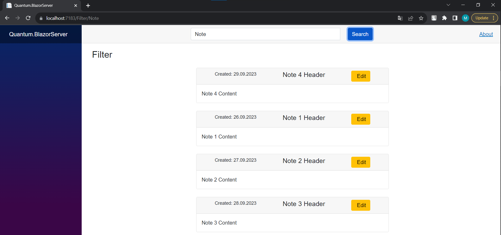
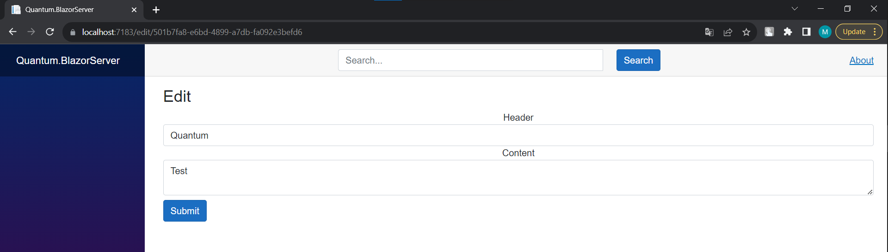

# Quantum.BlazorServer
The main part of the project that contains UI, DI, middlewares, etc.   
At this project I exeprimented with `SignalR` technologies to create real-time responsive web page for all clients.

## Set up
### Dependencies
Use `NuGet` package manager to install these dependecies:

- `Microsoft.AspNetCore.SignalR.Client`

### Connection string
Change connection string at `appsettings.json` 

```
 "ConnectionStrings": {
    "postgreSql": "Host=localhost;Database=postgres;Username=postgres;Password=123456"
  },
```
## Images

SignalR magic


Edit Page



Filter Page

