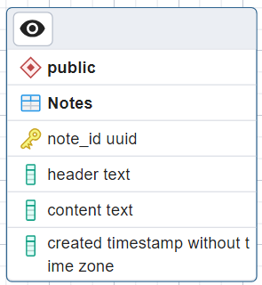

# Quantum.Data
The part of the project that is responsible for working with the database and data, for example: connecting to the database, processing data, migrating data, etc.

## Set up
### Dependencies
Use `NuGet` package manager to install these dependecies:

- `Microsoft.EntityFrameworkCore`
- `Microsoft.EntityFrameworkCore.Tools`
- `Npgsql.EnityFrameworkCore.PostgreSQL`

### Connection string
Set your connection string at [PostgreSqlContextFactory]("/Context/PostgreSqlContextFactory.cs")

```csharp
public class PostgreSqlContextFactory : IDesignTimeDbContextFactory<PostgreSqlContext>
    {
        public PostgreSqlContext CreateDbContext(string[] args)
        {
            var optionBuilder = new DbContextOptionsBuilder<PostgreSqlContext>();
            //Set your connection string
            var connectionString = "Host=localhost;Database=postgres;Username=postgres;Password=123456";
            optionBuilder.UseNpgsql(connectionString ?? throw new NullReferenceException(
                                         $"Connection string is not got from environment {nameof(connectionString)}"));
            return new PostgreSqlContext(optionBuilder.Options);
        }
    }
```
### Migrations
Set `Quantum.Data` as a startup project.

Use command `Update-database` at `Package Manager Console` to create and fill database 

Or use EF CLI commands 

```
dotnet-ef database update --project Quantim.Data --context PostgreSqlContext
```

## Images

Scema


